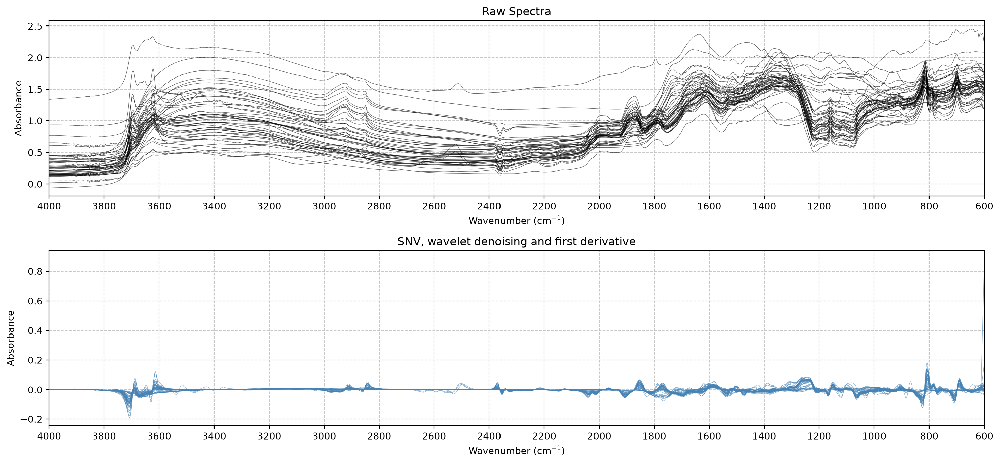

# SoilSpecTfm


<!-- WARNING: THIS FILE WAS AUTOGENERATED! DO NOT EDIT! -->

SoilSpecTfm corrects, smooths and resamples soil infrared spectra before modeling. It covers scatter correction, Savitzky-Golay smoothing and derivatives, wavelet denoising, conversion to absorbance, resampling and trimming. Each transformer follows the scikit-learn API. You can chain them in a `Pipeline`, tune their parameters with `GridSearchCV`, and put them in front of any scikit-learn model.

[SoilSpecData](https://fr.anckalbi.net/soilspecdata/) loads the Open Soil Spectral Library (OSSL) as spectra and soil properties ready for these transformers. The [SoilSpecTfm documentation](https://fr.anckalbi.net/soilspectfm/) covers the full API.

## Installation

``` sh
pip install -U soilspectfm
```

To install the development version, with nbdev and SoilSpecData, run this in the project root with [uv](https://docs.astral.sh/uv/):

``` sh
uv sync --extra dev
```

## Features

| Transformer | What it does |
|----|----|
| [`SNV`](https://franckalbinet.github.io/soilspectfm/preprocessing.html#snv) | Centers and scales each spectrum (standard normal variate) |
| [`MSC`](https://franckalbinet.github.io/soilspectfm/preprocessing.html#msc) | Corrects each spectrum against a reference spectrum (multiplicative scatter correction) |
| [`SavitzkyGolay`](https://franckalbinet.github.io/soilspectfm/preprocessing.html#savitzkygolay) | Smooths each spectrum, or takes its derivative |
| [`WaveletDenoise`](https://franckalbinet.github.io/soilspectfm/preprocessing.html#waveletdenoise) | Removes noise by thresholding wavelet coefficients |
| [`ToAbsorbance`](https://franckalbinet.github.io/soilspectfm/preprocessing.html#toabsorbance) | Converts reflectance to absorbance |
| [`Resample`](https://franckalbinet.github.io/soilspectfm/preprocessing.html#resample) | Interpolates spectra onto new wavenumbers |
| [`Trim`](https://franckalbinet.github.io/soilspectfm/preprocessing.html#trim) | Keeps the wavenumbers inside a range |

`soilspectfm.datasets` loads the two toy datasets, and `soilspectfm.visualization` plots spectra.

## Quick start

`from soilspectfm.all import *` imports every transformer, the toy dataset loaders and the plotting functions. Load the toy MIR spectra that ship with the package, then preprocess them with standard normal variate (SNV), wavelet denoising and a first derivative:

``` python
from soilspectfm.all import *
from sklearn.pipeline import Pipeline
```

``` python
X, ws = load_toy_mir()
pipe = Pipeline([('snv', SNV()), ('denoise', WaveletDenoise()), ('deriv', SavitzkyGolay(window_length=11, polyorder=2, deriv=1))])
X_tfm = pipe.fit_transform(X)
X_tfm.shape
```

    (50, 1701)

Compare the raw and preprocessed spectra:

``` python
plot_spectra_comparison(X, X_tfm, ws, transformed_title='SNV, wavelet denoising and first derivative');
```



## Modeling OSSL data

SoilSpecData gives the spectra `X` and soil properties `y` of the OSSL samples. This example predicts cation exchange capacity (CEC) from MIR spectra with partial least squares regression, and scores it with 5-fold cross-validation. The first call to `load_ossl` downloads about 1 GB:

``` python
from soilspecdata.all import *
from sklearn.cross_decomposition import PLSRegression
from sklearn.model_selection import cross_val_score
```

``` python
X, y, ids = load_ossl().mir().xy('cec_usda.a723_cmolc.kg')
model = Pipeline([('snv', SNV()), ('deriv', SavitzkyGolay(window_length=11, polyorder=2, deriv=1)), ('pls', PLSRegression(n_components=10))])
cross_val_score(model, X, y, cv=5, scoring='r2')
```

## Upgrading from 0.0.x

Version 0.1.0 changes the API of `soilspectfm`. To update code written for version 0.0.x:

- `soilspectfm.core` is now `soilspectfm.preprocessing`. To import every transformer, loader and plotting function at once, use `from soilspectfm.all import *`.
- [`SavitzkyGolay`](https://franckalbinet.github.io/soilspectfm/preprocessing.html#savitzkygolay) replaces `TakeDerivative` and `SavGolSmooth`. Its defaults are `window_length=15`, `polyorder=3` and `deriv=0`, the old `SavGolSmooth` defaults. Replace `SavGolSmooth(...)` with `SavitzkyGolay(...)`. Replace `TakeDerivative()` with `SavitzkyGolay(window_length=11, polyorder=1, deriv=1)`, because the defaults differ.
- [`MSC`](https://franckalbinet.github.io/soilspectfm/preprocessing.html#msc) no longer accepts `n_jobs`.
- [`Resample.fit`](https://franckalbinet.github.io/soilspectfm/preprocessing.html#resample.fit) raises a `ValueError` when `target_x` goes outside the range of `source_x`. [`Resample.transform`](https://franckalbinet.github.io/soilspectfm/preprocessing.html#resample.transform) now requires `fit` first.
- `soilspectfm.utils` is now `soilspectfm.datasets`. It no longer exports `toy_mir_url` and `toy_noisy_mir_url`. The toy datasets ship with the package, and [`load_toy_mir`](https://franckalbinet.github.io/soilspectfm/datasets.html#load_toy_mir) and [`load_toy_noisy_mir`](https://franckalbinet.github.io/soilspectfm/datasets.html#load_toy_noisy_mir) read them without a network connection.

## Contributing

Contributions are welcome. SoilSpecTfm is built with [nbdev](https://nbdev.fast.ai/): the notebooks in `nbs/` are the source of the code, the documentation and the tests. After changing a notebook, export the code, run the tests, clean the notebooks and rebuild the README with:

``` sh
uv run nbdev-prepare
```

Report bugs and ask questions in [GitHub issues](https://github.com/franckalbinet/soilspectfm/issues).

## License

SoilSpecTfm is under the [Apache 2.0](LICENSE) licence.

## Citation

- [SoilSpecTfm](https://github.com/franckalbinet/soilspectfm): Albinet, F., 2026. SoilSpecTfm, version 0.1.0. https://github.com/franckalbinet/soilspectfm
